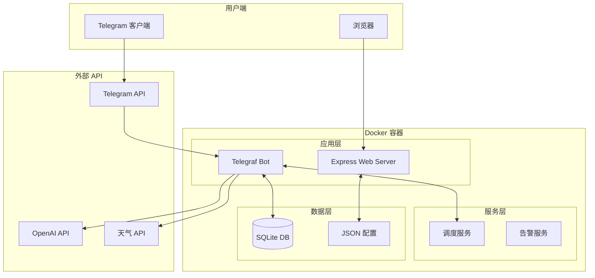

# 从零开始：用 Docker 部署一个功能强大的 Telegram 多功能机器人

> 本文将带你从零开始，使用 Docker 部署一个集成了 AI 聊天、RSS 订阅、翻译、天气查询等多种实用功能的 Telegram 机器人，并通过 Web 面板轻松管理。

## 📖 前言

在日常使用 Telegram 的过程中，我们经常希望有一个能帮我们处理各种杂事的机器人——翻译一段文字、生成二维码、订阅博客更新、甚至和 AI 聊天。市面上虽然有很多单一功能的机器人，但找一个"全能型选手"却不容易。

今天介绍的这个项目正是我基于这个需求开发的，它的特点是：
- 🤖 **功能丰富**：集成翻译、二维码、天气、汇率、RSS、AI 对话等 15+ 功能
- 🐳 **一键部署**：Docker Compose 一条命令启动
- 🖥️ **Web 管理**：可视化配置面板，无需改配置文件
- 📊 **使用统计**：内置调用统计和日志查看
- 🔒 **权限控制**：管理员专属功能，密码保护面板

---

## 🏗️ 技术架构

在深入部署之前，让我们先了解一下这个项目的技术栈：



### 核心组件

| 组件 | 技术 | 职责 |
|------|------|------|
| Bot 框架 | Telegraf | 处理 Telegram 消息和命令 |
| Web 服务 | Express | 提供配置面板和 API |
| 数据库 | better-sqlite3 | 存储用户数据、RSS 订阅等 |
| 调度器 | node-cron | 定时任务（RSS 检查、提醒） |
| 日志 | Winston | 日志记录和轮转 |

### 目录结构

```
tgbot/
├── data/                   # 数据持久化目录
│   ├── config.json         # 配置文件（自动生成）
│   ├── bot.db              # SQLite 数据库
│   └── logs/               # 日志文件
├── src/
│   ├── commands/           # 命令模块（每个功能一个文件）
│   │   ├── chat.js         # AI 对话
│   │   ├── translate.js    # 翻译
│   │   ├── rss.js          # RSS 订阅
│   │   └── ...
│   ├── core/               # 核心功能
│   │   └── loader.js       # 命令自动加载器
│   ├── db/                 # 数据库访问层
│   │   ├── connection.js   # 数据库连接
│   │   ├── rss.dao.js      # RSS 数据操作
│   │   └── ...
│   ├── services/           # 业务服务
│   │   ├── scheduler.service.js  # 定时调度
│   │   └── alert.service.js      # 告警通知
│   └── web/                # Web 面板
│       ├── server.js       # Express 服务
│       └── public/         # 前端静态文件
├── docker-compose.yml
├── Dockerfile
└── index.js                # 入口文件
```

---

## 🚀 部署教程

### 前置条件

- 一台安装了 Docker 和 Docker Compose 的服务器（VPS、家用服务器均可）
- 一个 Telegram 账号
- （可选）OpenAI API Key（用于 AI 功能）

### 第一步：创建 Telegram Bot

1. 在 Telegram 中搜索 [@BotFather](https://t.me/BotFather)
2. 发送 `/newbot` 命令
3. 按提示输入机器人名称和用户名
4. 保存获得的 **Bot Token**（格式如 `123456789:ABCdefGHIjklMNOpqrsTUVwxyz`）

```
📋 记下你的 Bot Token，后面会用到
```

### 第二步：获取你的用户 ID（可选但推荐）

如果你想接收 Bot 的启动通知和使用管理员功能，需要获取你的 Telegram 用户 ID：

1. 搜索 [@userinfobot](https://t.me/userinfobot) 或 [@getmyid_bot](https://t.me/getmyid_bot)
2. 向它发送任意消息
3. 记下返回的数字 ID

### 第三步：部署机器人

**方式一：Docker Compose（推荐）**

```bash
# 克隆仓库
git clone https://github.com/debbide/tgbot.git
cd tgbot

# 启动服务
docker-compose up -d

# 查看日志（可选）
docker-compose logs -f
```

**方式二：Docker 命令**

```bash
docker run -d \
  --name tgbot \
  -p 3000:3000 \
  -v ./data:/app/data \
  --restart unless-stopped \
  ghcr.io/debbide/tgbot:latest
```

> 💡 **提示**：使用 `-v ./data:/app/data` 可以将数据持久化到宿主机，即使容器重建也不会丢失配置。

### 第四步：配置机器人

1. 打开浏览器访问 `http://你的服务器IP:3000`
2. **首次访问需要设置管理员密码**（至少 6 位）
3. 登录后在配置面板中填写：

| 配置项 | 必填 | 说明 |
|--------|------|------|
| Bot Token | ✅ | 从 @BotFather 获取的 Token |
| 管理员 ID | ❌ | 可选，用于接收 Bot 启动通知 |
| OpenAI API Key | ❌ | 可选，用于 AI 聊天和摘要功能 |
| OpenAI API Base | ❌ | 默认使用官方 API，可配置中转服务 |

4. 点击 **💾 保存配置**
5. 点击顶部的 **🔄 重启** 按钮

---

## 💡 功能详解

### 🌐 翻译 (`/tr`)

一键翻译文本到中文，也支持指定目标语言：

```
# 翻译到中文（默认）
/tr Hello, how are you?

# 翻译到英文
/tr en 你好，今天天气怎么样？

# 翻译到日文
/tr ja 美丽的风景
```

**实现原理**：使用 `google-translate-api-x` 库调用 Google 翻译服务，无需 API Key。

### 🤖 AI 对话 (`/chat` 或 `/c`)

与 OpenAI 驱动的 AI 助手对话，支持多轮上下文：

```
/chat 帮我写一首关于春天的诗
/c 再换一个更优美的版本

# 清除对话历史
/chat clear
```

**特点**：
- 支持多轮对话记忆（最近 6 轮）
- 风格轻松幽默
- 兼容 OpenAI API 及中转服务（如 one-api）

### 📰 RSS 订阅 (`/rss`)

订阅博客、新闻等 RSS 源，自动推送更新：

```
# 添加订阅
/rss add https://sspai.com/feed

# 查看订阅列表
/rss list

# 删除订阅
/rss del 1

# 设置检查间隔（分钟）
/rss interval 15
```

**关键词过滤功能**：

```
# 只推送包含特定关键词的文章
/rss kw add AI,科技,开源

# 排除包含特定词汇的文章
/rss ex add 广告,招聘

# 查看当前关键词配置
/rss kw list
```

### ⏰ 定时提醒 (`/remind`)

设置定时提醒，支持固定时间和倒计时：

```
# 固定时间提醒
/remind 14:30 下午开会

# 倒计时提醒
/remind 30m 休息一下
/remind 2h 该喝水了

# 查看所有提醒
/reminders
```

### 📱 二维码 (`/qr`)

快速生成二维码图片：

```
/qr https://github.com
/qr 这是一段文字
```

### 🌤️ 天气查询 (`/weather`)

查询全球任意城市的天气：

```
/weather 北京
/weather Tokyo
/weather New York
```

### 💰 汇率换算 (`/rate`)

实时汇率换算：

```
/rate USD CNY 100
/rate 100 usd cny
/rate EUR JPY 50
```

### 🌍 网络工具

```
# IP 归属地查询
/ip 8.8.8.8

# Whois 域名信息
/whois github.com
```

---

## 🛠️ 进阶配置

### 使用 Telegram API 代理

如果你的服务器无法直接访问 Telegram API，可以配置代理：

1. 在 Web 面板中填写 `TG API Base`
2. 格式：`https://your-proxy.com/bot`
3. 常见中转服务：
   - [Cloudflare Worker 代理](https://github.com/vrnobody/V2RayGCon/wiki/TelegramBot-Gateway)
   - 自建 Nginx 反向代理

### 配置 OpenAI 中转

如果使用 one-api、new-api 等中转服务：

```
API Base: https://your-one-api.com/v1
API Key: sk-xxxx
Model: gpt-4o-mini
```

### 自定义 AI 角色

目前 AI 角色在代码中定义，未来将支持在 Web 面板中配置。如需自定义，可修改 `src/commands/chat.js` 中的 `SYSTEM_PROMPT`。

---

## 🔧 开发指南

如果你想扩展新功能或进行本地开发：

### 本地运行

```bash
# 克隆仓库
git clone https://github.com/debbide/tgbot.git
cd tgbot

# 安装依赖
npm install

# 启动开发模式（支持热重载）
npm run dev
```

### 添加新命令

项目采用模块化设计，添加新命令非常简单：

1. 在 `src/commands/` 下创建新文件，如 `myfeature.js`
2. 实现 `setupXxxCommand(bot, options)` 函数并导出
3. 重启 Bot

**示例模板**：

```javascript
/**
 * 我的新功能
 */
const { statsDb } = require('../db');

function setupMyFeatureCommand(bot, options) {
    bot.command('myfeature', async (ctx) => {
        const userId = String(ctx.from.id);
        
        // 记录使用统计
        statsDb.record(userId, 'myfeature');
        
        // 你的逻辑
        await ctx.reply('Hello from my new feature!');
    });
}

module.exports = { setupMyFeatureCommand };
```

### 数据库操作

项目使用 SQLite，通过 DAO 层访问数据：

```javascript
const { rssDb, reminderDb, statsDb } = require('../db');

// 添加 RSS 订阅
rssDb.add(userId, chatId, url, title);

// 获取用户的提醒
reminderDb.list(userId);

// 记录命令使用
statsDb.record(userId, 'weather');
```

---

## 📊 监控与运维

### Web 面板功能

- **📈 使用统计**：查看总调用次数、今日调用、用户数
- **📋 命令排行**：可视化展示各命令使用频率
- **📝 实时日志**：查看 Bot 运行日志（支持 SSE 实时推送）
- **🔄 一键重启**：无需 SSH，直接在面板重启 Bot
- **🔐 密码管理**：可在面板中修改登录密码

### 日志管理

Bot 使用 Winston 进行日志管理：
- 日志文件位于 `data/logs/` 目录
- 自动按天轮转，保留 14 天
- 可在 Web 面板查看和清空

### 健康检查

提供 `/health` 端点用于监控：

```bash
curl http://localhost:3000/health
```

返回：
```json
{
  "status": "ok",
  "botRunning": true,
  "uptime": 3600,
  "timestamp": 1703001234567
}
```

---

## ❓ 常见问题

### Q: Bot 启动失败，提示 Token 无效？

A: 请检查：
1. Token 是否正确复制（不要漏掉任何字符）
2. 是否已在其他地方运行同一个 Bot（一个 Token 只能单实例运行）

### Q: 无法连接 Telegram API？

A: 可能是网络问题：
1. 确认服务器能访问 `api.telegram.org`
2. 如果在国内服务器，需要配置 API 代理
3. 尝试使用 `ping api.telegram.org` 测试连通性

### Q: AI 功能返回错误？

A: 检查 OpenAI 配置：
1. API Key 是否正确
2. API Base 地址是否可访问
3. 账户余额是否充足

### Q: RSS 订阅没有推送？

A: 可能的原因：
1. RSS 源本身没有更新
2. 检查关键词过滤设置（如果设置了关键词，只有匹配的才会推送）
3. 查看日志确认是否有解析错误

### Q: 如何备份数据？

A: 所有数据都在 `data/` 目录下：
```bash
# 备份
cp -r data/ data_backup/

# 恢复
cp -r data_backup/* data/
docker-compose restart
```

---

## 🎯 总结

通过这篇教程，你应该已经成功部署了一个功能强大的 Telegram 多功能机器人。这个项目的优势在于：

1. **开箱即用**：Docker 一键部署，无需复杂配置
2. **可视化管理**：Web 面板管理配置，无需 SSH
3. **功能丰富**：涵盖日常使用的各种场景
4. **易于扩展**：模块化设计，添加新功能非常简单
5. **数据持久**：SQLite + 文件存储，重启不丢失

如果在使用过程中遇到问题，欢迎在 GitHub 上提 Issue。如果觉得这个项目对你有帮助，请给个 ⭐ Star！

**项目地址**：[https://github.com/debbide/tgbot](https://github.com/debbide/tgbot)

---

> 📝 **作者按**：这个机器人最初是我自己用的，后来发现功能越来越多，索性开源出来。希望能帮到同样有需求的朋友。如果你有好的功能建议，也欢迎 PR！
